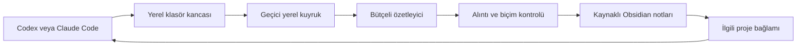

# Raven

**Codex ve Claude Code için ortak, kaynaklı ikinci beyin.**

Raven, aynı yerel çalışma klasöründeki sohbetlerin anlamlı sonuçlarını Obsidian notlarına dönüştürür. Bir sağlayıcıda konuşulan karar, diğer sağlayıcının sonraki oturumunda ilgili kaynağıyla bulunabilir. Büyük çalışma dosyaları ayrı proje klasörlerinde kalır.

Bu depo **yazılım ve boş başlangıç şablonudur**. Kişisel not, sohbet geçmişi, API anahtarı, hesap eşlemesi veya canlı kurulumun Git geçmişini içermez.

## Neler yapar?

- Desteklenen klasör kancalarından yeni kullanıcı mesajını ve son görünür yanıtı alır.
- Ham tur metnini vault dışında geçici kuyrukta tutar; başarılı özetlemede temizler.
- Ayrı oturum notları ve proje derlemeleri oluşturur; özetlerin kaynak konuşmacısını ve birebir alıntısını korur.
- Her tur için asıl ajanı yeniden çalıştırmaz. Küçük gruplar halinde, sınırlandırılmış model çağrılarıyla derler.
- “Bu sohbeti kaydetme” ve “dosya değiştirme” gibi ifadeleri destekler; kesin kontrol için pause/resume araçları vardır.
- Kullanıcının elle değiştirdiği üretilmiş notları sessizce ezmez.
- Mem0 ve Todoist için isteğe bağlı, filtrelenmiş entegrasyon altyapısı sağlar. Bu entegrasyonlar başlangıçta kapalıdır.

## Destek sınırı

| Ortam | Durum |
| --- | --- |
| Windows + Python 3.11 veya sonrası | Bu sürümün hedefi ve test ortamı |
| Codex CLI / masaüstünde yerel klasör | Kancalar etkin ve güven verilmişse desteklenir |
| Claude Code / masaüstünde yerel Code çalışma alanı | Yerel kancalar etkinse desteklenir |
| Normal ChatGPT veya Claude web sohbetleri | Otomatik toplanmaz |
| macOS / Linux | Bu dağıtım için doğrulanmadı; Windows kimlik deposu ve zamanlayıcı kodu bulunur |

Bu bir model değildir ve bağımsız sohbet arayüzü içermez. Codex/Claude aboneliği veya uygun sağlayıcı erişimi gerekir. Model isimleri ve hesap erişimi değişebilir; kurulumda kendi hesabındaki modeli seç.

## Kurulum

1. Python 3.11+, Git ve kullanacağın Codex/Claude Code istemcisini kurup hesabına giriş yap. Obsidian, notları görsel olarak kullanmak için isteğe bağlıdır.
2. Bu depoyu indir veya klonla. **Kişisel sohbetlerini bu kaynak deposunda yapma.**
3. PowerShell'de depo klasöründen, ayrı ve henüz var olmayan bir vault oluştur:

```powershell
python tools/setup.py --vault "$env:USERPROFILE\Documents\MyRaven" --user "Adın"
```

Bu komut mevcut klasörün üstüne yazmaz, model çağırmaz, hesap bağlamaz ve arka plan görevi kurmaz. Otomatik kayıt ve bulut derleme **kapalı** başlar.

Otomatik hafızayı kurulum sırasında bilinçli olarak açmak için, henüz var olmayan hedefte:

```powershell
python tools/setup.py --vault "$env:USERPROFILE\Documents\MyRaven" --user "Adın" --runner codex --model "HESABINDAKI_MODEL_ADI" --enable-memory
```

`HESABINDAKI_MODEL_ADI` bir yer tutucudur. Claude özetleyicisi için `--runner claude --model haiku` seçilebilir; model erişimini hesabında doğrula. Çalıştırıcı bulunmazsa `--codex "...\codex.exe"` veya `--claude "...\claude.exe"` ile konumunu belirt. Kurucu PATH'i ve bilinen Windows masaüstü kurulum konumlarını kontrol eder; yazılım indirmez.

**`--enable-memory`, yakalanan ilgili tur metninin seçtiğin bulut özetleyicisine gönderilmesine izin verir. Claude kaynaklı bir tur, özetleyici Codex ise OpenAI tarafından da işlenir.**

4. Oluşturulan klasörü Codex'te **yerel proje**, Claude Code'da **çalışma klasörü**, Obsidian'da **vault** olarak aç. Uygulama içindeki klasör/kanca güvenini kendin inceleyip ver. Kurucu güven onayını taklit etmez.
5. Otomatik hafıza etkinse işçiyi bir kez elle çalıştır:

```powershell
python "$env:USERPROFILE\Documents\MyRaven\00-System\Scripts\memory_worker.py" --force
```

15 dakikalık arka plan döngüsünü ayrıca kurmak için:

```powershell
& "$env:USERPROFILE\Documents\MyRaven\00-System\Scripts\install-memory-task.ps1"
```

Görev mevcut kullanıcıyla ve penceresiz çalışır. Kullanıcı oturumu/bilgisayar kapalıyken işlenmez. PowerShell yürütme politikası engellerse genel güvenlik ayarını kapatma; betiği inceleyip kurumunun/Windows'un izin verdiği yöntemi kullan veya işçiyi elle çalıştır.

Kapalı kurulumda daha sonra açmak için vault içindeki `00-System/Config/memory.json` dosyasına geçerli `runner`, `model`, çalıştırıcı yollarını gir; `enabled` ve `cloud_processing` alanlarını, veri işleme kapsamını kabul ediyorsan `true` yap. Kaynak şablonundaki ayarları değiştirme.

## Günlük kullanım

Raven klasöründe ayrı sohbetler açıp normal çalış. Aynı işe ait oturumlarda “Bu sohbetin projesi Kafe” gibi aynı proje adını belirt. Eşleştirilmemiş oturumlar `general` alanını kullanır; proje eşlemesi gizlice tahmin edilmez.

- **“Bu sohbeti kaydetme.”** Sonraki turlar için de otomatik kaydı durdurur; önceki kayıtları silmez.
- **“Yalnız oku, dosya değiştirme.”** O tur otomatik kuyruğa alınmaz.
- **“Bu sohbetin Raven hafızasını unut.”** Açık silme isteğiyle etkin hafızayı kaldırma akışını başlatır; sağlayıcı geçmişi ve eski yedekler ayrıdır.

Dashboard → ortak hafıza ve hafıza durumu. Yeni hafıza derleme tamamlanınca görünür; anlık eşitleme garantisi yoktur. Otomatik özet, doğrulanmış kişisel tercih veya tamamlanmış görev değildir. Geçici test bilgisi bir özet içinde test olarak anılabilir; sistem kusursuz bir anlamsal eleme filtresi değildir.

## Varsayılan sınırlar

| Sınır | Değer |
| --- | --- |
| Model çağrısı | En fazla 8/gün; başarısız deneme dahil |
| Grup | En fazla 6 tur / 16000 kaynak karakteri |
| Kullanıcı mesajı | En fazla 8000 karakter |
| Günlük istek karakteri | 96000 |
| Yeniden deneme | İş başına en fazla 2 |
| Sessizlik süresi | En az 120 saniye |
| Bekleyen ham içerik | 3 gün sonraki bakımda sona erer |
| Yerel kuyruk/veritabanı sınırı | 50 MB |

Modelin sistem bağlamı ve çıktısı ayrıca kullanım tüketir. Bunlar kesin ücret/kredi sınırları değildir. Yoğun kullanım, uzun mesajlar veya kesintiler nedeniyle her tur kalıcı hafızaya dönüşmeyebilir. Durum ekranını takip et.

## Nasıl çalışır?



SQLite çalışma durumu ve arama indeksidir; okunabilir hafıza Markdown notlarında tutulur. Bu dağıtım her vault için ayrı yerel çalışma dizini kullanır. Kurulumdan sonra vault'u taşımak, yolların ve çalışma verisinin ayrıca taşınmasını gerektirir; kurucuyu mevcut klasör üzerinde yeniden çalıştırma.

## Geliştirme ve kontroller

```powershell
python -m unittest discover -s template/00-System/Tests -p "test_*.py"
python -m unittest discover -s tests -p "test_*.py"
python tools/release_check.py
```

Testler geçici klasörler ve sahte model yanıtları kullanır; sağlayıcı çağrısı veya API anahtarı gerekmez. GitHub Actions aynı kontrolleri Windows'ta çalıştırır. Canlı uygulama güveni ve bildirim teslimi, birim testlerinin kanıtladığı şeyler değildir.

Detaylar: [Mimari](docs/ARCHITECTURE.md), [gizlilik](docs/PRIVACY.md), [katkı](CONTRIBUTING.md), [değişiklikler](CHANGELOG.md).

## Köken ve lisans

Raven, kişisel bir Windows kurulumundan yeniden kullanılabilir şablona ayrıldı. Klasör tabanlı devamlılık ve derleme yaklaşımını düşünürken [avenoxbeyin](https://github.com/avenoxai/avenoxbeyin) incelendi. Bu depo o projenin Git geçmişini veya kullanıcı verilerini içermez; o proje ile resmî bağlantısı yoktur.

[MIT lisansı](LICENSE). OpenAI, Anthropic, Obsidian, Mem0 ve Todoist ile resmî bağlantısı yoktur.
