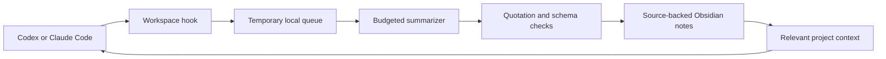

# Raven

**A shared, source-backed second brain for Codex and Claude Code.**

[Türkçe](README.tr.md) · [Architecture](docs/ARCHITECTURE.md) · [Privacy](docs/PRIVACY.md)

Raven turns useful outcomes from conversations in a local workspace into Obsidian notes. A decision discussed with one provider can be retrieved, with its source, in a later session with the other. Larger project files stay in their own folders.

## What Raven does

- Captures new user messages and final visible replies through supported workspace hooks.
- Temporarily queues raw turn text outside the vault and clears it after successful summarization.
- Creates session notes and project compilations with speaker attribution and verbatim source quotations.
- Processes small batches within configurable budgets, without asking the main agent to write a handoff after every turn.
- Supports conversation opt-out, read-only turns, pause/resume, and explicit forgetting.
- Protects generated notes that you have edited by hand.
- Offers optional, filtered Mem0 and Todoist integrations. Both are off by default.
- Includes English and Turkish presentation, with separate conversation and summary language preferences.

## Supported environments

| Environment | Support |
| --- | --- |
| Windows with Python 3.11+ | Target and automated test environment |
| Codex CLI or desktop local workspace | Requires enabled, trusted folder hooks |
| Claude Code or desktop local Code workspace | Requires enabled local hooks |
| Ordinary ChatGPT or Claude web chats | Not collected automatically |
| macOS / Linux | Not validated for this distribution; some components use Windows credentials and scheduling |

Raven is not a model or a standalone chat application. You need access to your chosen Codex or Claude Code client. Select a summarizer model available to your account; Raven does not supply provider access.

## Get started

Install Python 3.11+, Git, and your chosen Codex or Claude Code client, then sign in. Obsidian is optional for browsing notes visually.

Clone or download this repository. **Keep personal conversations out of the source repository.** From its folder in PowerShell, create a separate vault that does not already exist:

```powershell
python tools/setup.py --vault "$env:USERPROFILE\Documents\MyRaven" --user "Your name" --language en
```

The installer refuses to overwrite an existing folder. It does not call a model, connect external accounts, install a background task, or grant hook trust. Capture and cloud summarization start **off**.

For an English interface with Turkish conversations and new summaries:

```powershell
python tools/setup.py --vault "$env:USERPROFILE\Documents\MyRaven" --language en --conversation-language tr --summary-language tr
```

Use `--language tr` for Turkish presentation. Conversation language defaults to `auto` (follow the user); summary language defaults to the initial interface language. These settings remain independent after installation.

### Enable automatic memory explicitly

Choose a new target folder and an available model:

```powershell
python tools/setup.py --vault "$env:USERPROFILE\Documents\MyRaven" --runner codex --model "YOUR_MODEL_NAME" --enable-memory
```

`YOUR_MODEL_NAME` is a placeholder. Use `--runner claude` to select Claude as the summarizer. If detection fails, provide `--codex "...\codex.exe"` or `--claude "...\claude.exe"`. The installer checks PATH and known Windows desktop installation locations; it does not download software.

**`--enable-memory` permits captured turn text to be processed by the selected cloud summarizer. A Claude conversation may therefore be processed by OpenAI if Codex is your summarizer, and vice versa.**

Open the installed vault as a local workspace in Codex or Claude Code, and as a vault in Obsidian. Review the application's folder and hook trust prompts yourself. To process a queued batch manually:

```powershell
python "$env:USERPROFILE\Documents\MyRaven\00-System\Scripts\memory_worker.py" --force
```

To install the optional 15-minute background schedule:

```powershell
& "$env:USERPROFILE\Documents\MyRaven\00-System\Scripts\install-memory-task.ps1"
```

The task runs without a visible window as the current user. It cannot process work while the computer is off or the user is signed out. If PowerShell policy blocks the script, review it and use an allowed execution method or run the worker manually; do not disable system-wide protections.

To enable an initially disabled installation later, edit its `00-System/Config/memory.json`: set a valid runner, model, and executable path, then set `enabled` and `cloud_processing` to `true` only when you accept the processing scope. Do not put personal settings in the public source template.

## Everyday use

Open separate conversations inside your Raven workspace and work normally. Explicitly assign conversations about the same work to the same project. Unassigned sessions belong to `general`; Raven does not silently guess a project.

- **“Do not save this conversation.”** Disables capture for subsequent turns in that conversation too. Earlier records remain.
- **“Read-only: do not change files.”** Skips capture for that turn.
- **“Forget this session's Raven memory.”** Requests removal from active Raven memory. Provider history and older backups are separate.

Natural-language detection is conservative, not exhaustive. Use session `pause`/`resume` controls or the global `enabled` setting for explicit control.

The Dashboard links to shared memory, processing status, projects, and reviews. New memories appear after compilation, not instantly. A generated summary is not a verified preference or proof that a task is complete. Short-lived test information may still appear as test information; semantic filtering is not perfect.

## Languages and desktop icons

From an installed vault, switch the interface with:

```powershell
python 00-System/Scripts/localization.py --ui en
```

Use `--ui tr` to switch back. Independently set `--conversation auto|en|tr` and `--summary en|tr` by choosing one value for each option.

The switch updates owned starter pages, templates, and Base display labels. It backs up affected files and refuses to overwrite an edited starter page. Personal notes, existing summary text, quotations, identifiers, filters, and integration settings are preserved. Generated memory pages use the new language when next published. Language changes use no model calls.

| Included icon | Purpose |
| --- | --- |
| `raven-terminal.ico` — blue raven | Raven / Codex terminal workspace |
| `raven-dashboard.ico` — purple symbol | RavenOS / Obsidian Dashboard |

Create desktop shortcuts from the source repository:

```powershell
./tools/create-shortcuts.ps1 -Vault "$env:USERPROFILE\Documents\MyRaven"
```

Provide `-CodexPath "...\codex.exe"` if needed. The Dashboard shortcut requires Obsidian and its registered URI handler. Existing shortcuts are never overwritten. See [language and icon details](docs/LANGUAGES.md).

## Default processing limits

| Limit | Default |
| --- | --- |
| Model calls | 8 per day, including failed attempts |
| Batch | Up to 6 turns / 16,000 source characters |
| User message | Up to 8,000 characters |
| Daily input characters | 96,000 |
| Attempts per job | 2 |
| Quiet period | At least 120 seconds |
| Pending raw content | Expires during maintenance after 3 days |
| Local queue/database cap | 50 MB |

Model context and output also consume usage. These are not exact spending or credit caps. Heavy use, long messages, or interruptions can prevent some turns from becoming memories; check the status page.

## How it works



SQLite stores runtime state and the retrieval index; readable memory lives in Markdown. Each vault has its own local runtime directory. Moving an installed vault requires migrating paths and runtime state; do not rerun the installer over an existing vault.

## Development

```powershell
python -m unittest discover -s template/00-System/Tests -p "test_*.py"
python -m unittest discover -s tests -p "test_*.py"
python tools/release_check.py
```

Tests use temporary folders and fake model responses, with no provider calls or API keys. GitHub Actions runs the same checks on Windows. Automated tests do not prove application trust, visual rendering, or phone notification delivery.

Read [Architecture](docs/ARCHITECTURE.md), [Privacy](docs/PRIVACY.md), [Contributing](CONTRIBUTING.md), and the [Changelog](CHANGELOG.md).

## Origins and license

Raven was extracted from a personal Windows setup into a reusable template. [avenoxbeyin](https://github.com/avenoxai/avenoxbeyin) informed discussion of folder-based continuity and compilation. This repository contains neither that project's Git history nor its users' data, and is not affiliated with it.

Released under the [MIT license](LICENSE), including the user-supplied icons. Not affiliated with OpenAI, Anthropic, Obsidian, Mem0, or Todoist.
